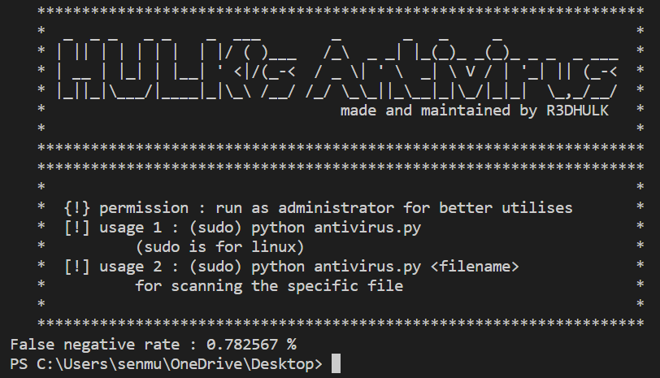
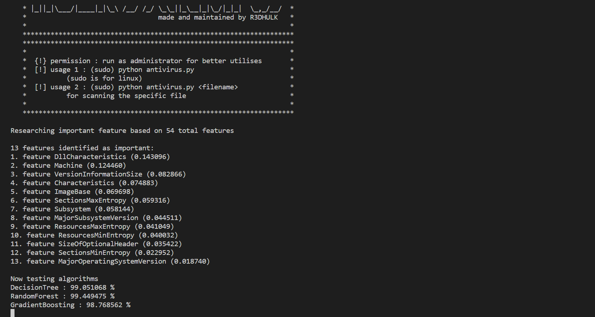
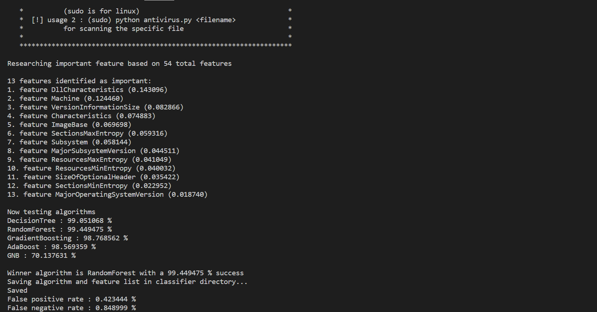
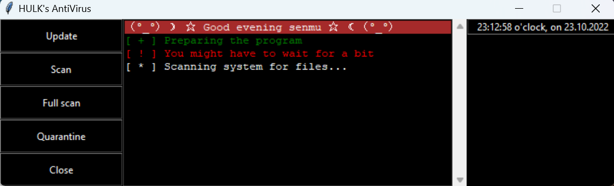
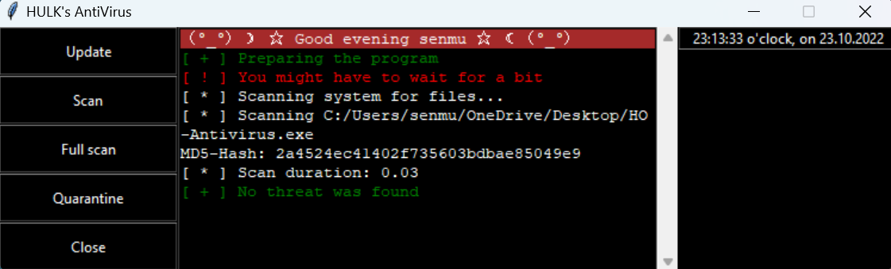

# HULK's Antivirus :
## Antiviruses are became quite popular in these days. Hackers become more powerful and technologies go like they are booming. By using those tricks they can easily hopped your system. If you are not supporting any costed antivirus, let me introduce my project to you. It is free, super fast, open source with almost 100% accuracy to find viruses or any kind of malwares.  
##
#
## You Can Download [data.csv](https://github.com/R3DHULK/antivirus/releases) To Run Antivirus Cli Properly
#
## 👨‍💻 Author : Sumalya Chatterjee
#
## It comes with two different interfaces :
## No. 1 : CLI
And
## No. 2 : GUI
##
#
## GIT Installation Process :
```
# Clone The Repo :
git clone https://github.com/R3DHULK/antivirus
# Change The Directory :
cd antivirus
# Execute program or
# Run The Software
python <whichever software you wanna execute> (i.e. : python hulk-antivirus.py)
```
#
# Cli Output :
## Cli Opening Window:

#
## Cli Processing Window:

#
## Cli Result Window:

#
# Gui Output:
## Gui Window:

#
## Gui Result:

#
##
# Found this project helpful? Consider Supporting me :
<p><a href="https://www.buymeacoffee.com/r3dhulk"> </a></p><br><br>
